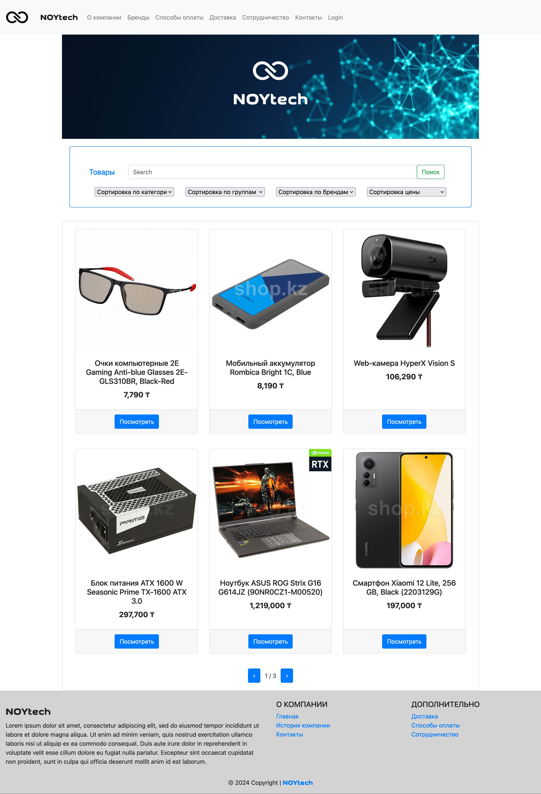
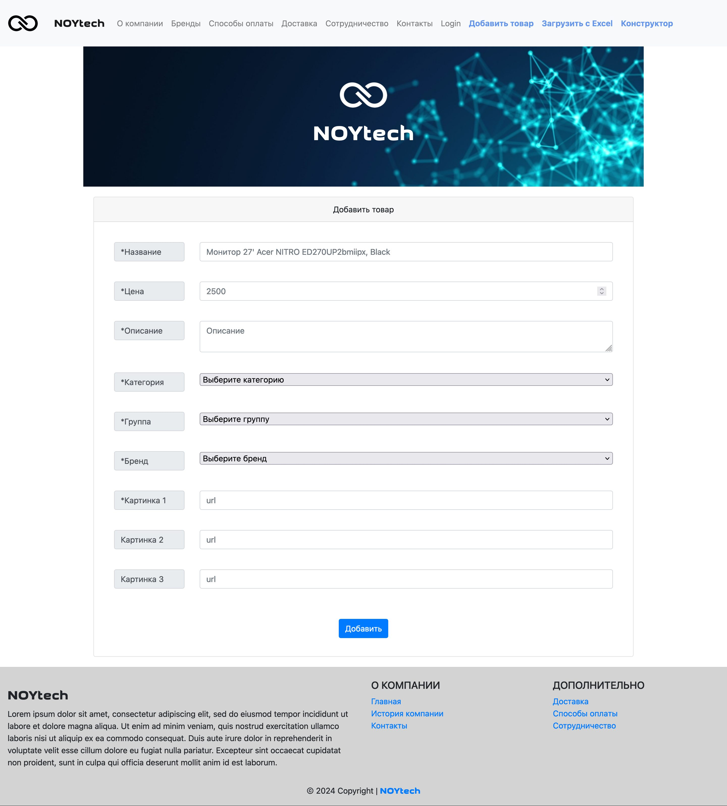
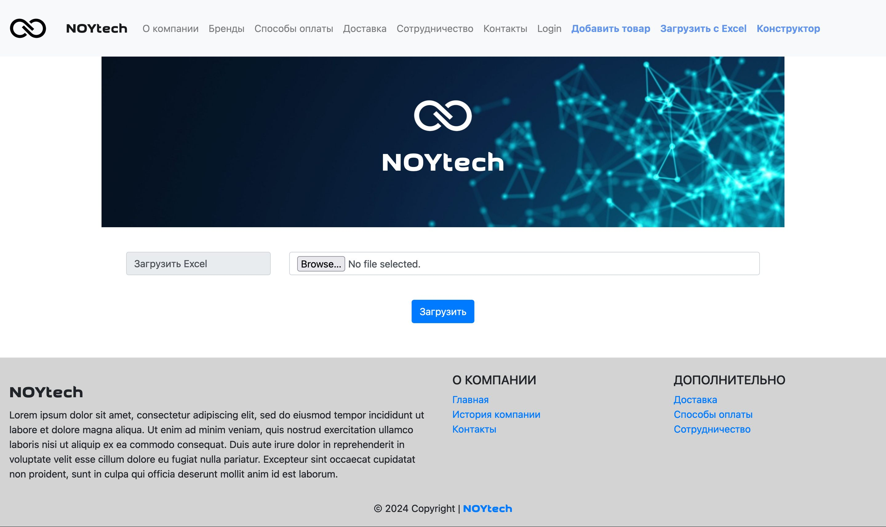

# E-commerce website template
E-commerse website template, built from scratch using Python and Flask.

## Gallery

### Front page


### Add new item


### Add items from Excel


## Run
```sh
python3 -m venv venv
source ./venv/bin/activate
pip install -r requirements.txt
./flask_run.sh
```

## LICENSE
All code is licensed under the BSL license.


